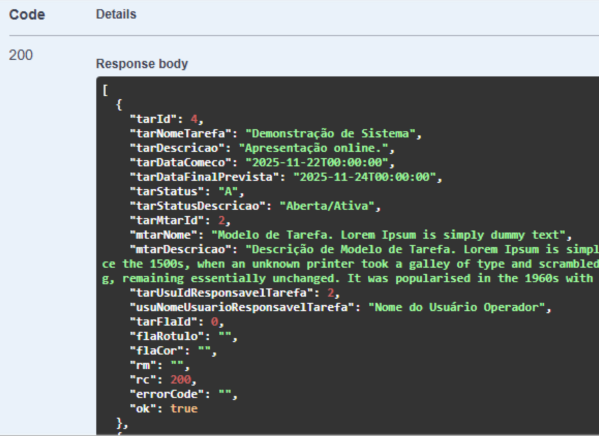

# SistemaTarefas API


[](https://dotnet.microsoft.com/)
[]()
[]()
[]()
[]()
[](LICENSE)

**API RESTful robusta em C# (.NET), criada para gerenciar Tarefas de forma padronizada e escalável.**

Inclui autenticação JWT, implementada no padrão Code First, com migrations do Entity Framework Core, exemplos prontos e documentação via Swagger.



## API com Projetos relacionados

**Esta API faz parte do ecossistema SistemaTarefas, desenvolvida em C# (.NET), seguindo princípios de arquitetura limpa, segurança, validação de entrada, e documentação via Swagger. O objetivo é fornecer uma base sólida e escalável para consumo por diferentes frontends — como o desenvolvido em React.js.**

| 🧩 Projetos | 💬 Descrição | 📁 Repositório|
|----------|------------|-------------|
| **API** | API RESTful desenvolvida em **C# (.NET)**, responsável por fornecer os dados e a lógica de negócio. | *(Este projeto)* |
| **Frontend** | Aplicação em **React.js** que consome a API e fornece a interface web para o usuário. | [SistemaTarefas Frontend](https://github.com/anderson-asouza/sistema-tarefas-react) |
| **Robot** | Automação em **Selenium** que interage com o frontend web para automatização de testes e processos. | [SistemaTarefas Robot](https://github.com/anderson-asouza/sistema-tarefas-robot) |


> 💡 Observação: Você pode testar a API diretamente pelo Swagger ou Postman.
>
> Para uma experiência mais completa, utilize junto com o frontend.
>
> O Robot depende do frontend estar acessível para realizar as automações.

Projetada para ser **flexível, confiável e de fácil manutenção**, ideal para sistemas profissionais.

> A documentação da API foi gerada utilizando Swagger e exportada para o formato Markdown (MD) para facilitar o compartilhamento e a manutenção do conteúdo.

📄 Você também pode conferir o manual da arquitetura do sistema:  
[Manual de Arquitetura da API](Manual%20de%20Arquitetura%20da%20API.pdf)

---

## Índice

- [1. Introdução](#1-introdução)
- [2. Interface de Resposta](#2-interface-de-resposta)
- [3. ResponseCode](#3-responsecode)
- [4. Métodos auxiliares para retorno](#4-métodos-auxiliares-para-retorno)
  - [4.1 Retorno (registro único)](#41-retorno-registro-único)
  - [4.2 RetornoLista (listas)](#42-retornolista-listas)
- [5. Exemplo de Controller](#5-exemplo-de-controller)
- [6. Exemplo de respostas JSON](#6-exemplo-de-respostas-json)
  - [6.1 Sucesso (registro único)](#61-sucesso-registro-único)
  - [6.2 Erro (registro não encontrado)](#62-erro-registro-não-encontrado)
  - [6.3 Lista de sucesso](#63-lista-de-sucesso)
- [7. Migrations e integridade referencial opcional](#7-migrations-e-integridade-referencial-opcional)
- [8. Justificativas do padrão](#8-justificativas-do-padrão)
- [9. Benefícios](#9-benefícios)


---

## 1. Introdução

Este projeto é uma API para Tarefas. O objetivo é demonstrar uma API robusta com técnicas profissionais.

Cada Tarefa é composta de vários trâmites. As Tarefas e Trâmites seguem Modelos que devem ser cadastrados antes.

🔐 **Credenciais iniciais do usuário Administrador definidas já no migrations do Entity Framework Core**  
(*Obrigatório alterar a senha no primeiro login*)

login: `admin`

senha: `senha123456`

> ⚙️ **Observação:**
> Arquivo `appsettings.json` é apenas um modelo de configuração para ambiente local.  
> Altere as chaves e conexões antes de usar.

**Pontos fortes:**
- **Padronização de respostas**: todas as respostas seguem o mesmo modelo (`IResponseModel`), facilitando o consumo pelo frontend.
- **Separação clara entre HTTP status e lógica da API**: `OK` e `RC` enriquecem a semântica sem substituir o HTTP status.
- **Métodos auxiliares genéricos** (`Retorno` e `RetornoLista`): reduzem repetição de código e simplificam manutenção.
- **Integração limpa com Entity Framework Core**: suporte a relacionamentos opcionais e integridade referencial.
- **Documentação clara e exemplos**: facilita aprendizado e integração para novos desenvolvedores.

---

## 2. Interface de Resposta

Todas as respostas da API derivam da interface `IResponseModel`:

```csharp
public interface IResponseModel
{
    string RM { get; set; }          // Mensagem legível da resposta
    ResponseCode RC { get; set; }    // Código de Status do HTTP
    string errorCode { get; set; }   // Código de erro traduzível
    bool OK { get; set; }            // Indica sucesso/falha
}
```
---

### 3. ResponseCode

Enumeração padronizada para todos os códigos internos da API:

```csharp
public enum ResponseCode
{
    Nulo = 0,
    OK = 200,
    CadastradoSucesso = 201,
    AceitoParaProcessamento = 202,
    SucessoSemConteudo = 204,
    BadRequest = 400,
    NaoAutorizado = 401,
    ForbidAcessoNegado = 403,
    RegistroNaoEncontrado = 404,
    Conflito = 409,
    EntidadeNaoProcessavel = 422,
    MuitasRequisicoes = 429,
    Excecao = 500,
    ServicoIndisponivel = 503
    // demais códigos HTTP relevantes
}
```
Com extensão para obter descrições legíveis:

```csharp
string mensagem = ResponseCode.BadRequest.GetDescription(); // "Requisição inválida."
```

### 4. Métodos auxiliares para retorno

#### 4.1 Retorno (registro único)*

```csharp
ActionResult<T> Retorno<T>(ControllerBase controller, T model, ResponseCode code = ResponseCode.OK, string? mensagem = "", string? uri = "")
    where T : class, IResponseModel, new()
```
    
- Preenche RM, RC, OK e errorCode.
- Retorna status HTTP adequado (200, 201, 204, 400, 404, 500, etc.).

Exemplo:

```csharp
var usuario = await _usuarioRepositorio.BuscarUm(idUsuario);
return Controladores.Retorno(this, usuario);
```

#### 4.2 RetornoLista (listas)

```csharp
ActionResult<List<T>> RetornoLista<T>(ControllerBase controller, IEnumerable<T> models, ResponseCode code = ResponseCode.OK, string? mensagem = "", string? uri = "")
    where T : class, IResponseModel, new()
```

- Padroniza listas, preenchendo os mesmos campos do IResponseModel.
- Detecta listas com apenas um item de erro.

Exemplo:

```csharp
var usuarios = await _usuarioRepositorio.BuscarVarios(nomeUsuario);
return Controladores.RetornoLista(this, usuarios, ResponseCode.OK);
```

### 5. Exemplo de Controller

```csharp
[Authorize(Policy = "NivelAcesso1")]
[HttpGet("{idUsuario}")]
public async Task<ActionResult<UsuarioResponse>> BuscarUm([FromRoute] int idUsuario)
{
    try
    {
        var usuario = await _usuarioRepositorio.BuscarUm(idUsuario);
        return Controladores.Retorno(this, usuario);
    }
    catch (Exception ex)
    {
        Servico.GravaLog(nameof(UsuariosController), ex);
        return Controladores.Retorno(this, new UsuarioResponse
        {
            RM = Servico.MSG_EXCEPTION,
            RC = ResponseCode.Excecao,
            OK = false
        });
    }
}
```

### 6. Exemplo de respostas JSON

#### 6.1 Sucesso (registro único)

```csharp
{
    "RM": "Registro encontrado",
    "RC": 200,
    "errorCode": "",
    "OK": true,
    "Nome": "João Silva",
    "Email": "joao@exemplo.com"
}
```

#### 6.2 Erro (registro não encontrado)

```csharp
{
    "RM": "Registro não encontrado.",
    "RC": 404,
    "errorCode": "REGISTRO_NAO_ENCONTRADO",
    "OK": false
}
```

#### 6.3 Lista de sucesso

```csharp
[
    {
        "RM": "Sucesso!",
        "RC": 200,
        "errorCode": "",
        "OK": true,
        "Nome": "João Silva"
    },
    {
        "RM": "Sucesso!",
        "RC": 200,
        "errorCode": "",
        "OK": true,
        "Nome": "Maria Santos"
    }
]
```

### 7. Migrations e integridade referencial opcional

A API utiliza **Entity Framework Core migrations** com **Foreign Keys opcionais**.
Exemplo:

```csharp
builder.HasOne(d => d.TraUsuIdTramitadorNavigation)
    .WithMany(p => p.TramitesTramitador)
    .HasForeignKey(d => d.TraUsuIdTramitador) // pode ser nulo
    .OnDelete(DeleteBehavior.Restrict)
    .HasConstraintName("FK_Tramites_UsuariosTramitador");
```

- Permite que campos como Tramitador ou Revisor sejam **opcionais**.

- Mantém a **integridade referencial** quando preenchidos.

- Evita colocar regras complexas de integridade somente no código-fonte.

- Isso é um diferencial, pois muitos projetos não utilizam índices opcionais, preferindo regras no backend.

Outro exemplo de relação com Tarefas:

```csharp
builder.HasOne(d => d.TraTarIdNavigation)
    .WithMany(p => p.Tramites)
    .HasForeignKey(d => d.TraTarId)
    .OnDelete(DeleteBehavior.Cascade)
    .HasConstraintName("FK_Tramites_Tarefas");
```

### 8. Justificativas e FAQ do padrão

**Por que não usar apenas HTTP status?**  
> O booleano `OK` é mais direto para frontends e facilita o consumo via AJAX ou fetch. Ele não substitui o status HTTP, apenas **enriquece a semântica**.

**Isso não duplica a semântica do HTTP status?**  
> Não. O HTTP status segue no cabeçalho, enquanto `RC` e `RM` no corpo oferecem informações legíveis e traduzíveis, úteis especialmente para frontends e APIs públicas.

**Pode confundir novos desenvolvedores?**  
> Com `Retorno` e `RetornoLista`, o uso é simples, consistente e reforçado com exemplos e middleware de exceção.

**Por que existem funções de verificação de integridade referencial na API, se o banco já possui Foreign Keys?**  
> Mesmo com as relações de integridade definidas no banco, algumas funções de verificação foram adicionadas para:  
> - Retornar mensagens de erro mais claras e compreensíveis para o frontend.  
> - Permitir que a API seja adaptada para outros cenários ou bancos de dados, caso regras ou estruturas mudem.  
>
> O possível impacto na performance é mínimo e justificado, pois o benefício de **feedback claro e maior flexibilidade** supera o custo de uma consulta adicional.


### 9. Benefícios

- Consistência em todos os endpoints.

- Facilita testes e integração com Swagger.

- Permite mensagens de erro detalhadas e códigos traduzíveis (errorCode).

- Facilita tratamento automático de exceções com middleware.